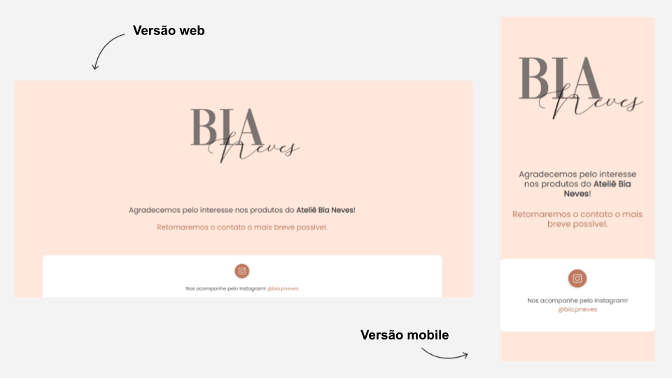
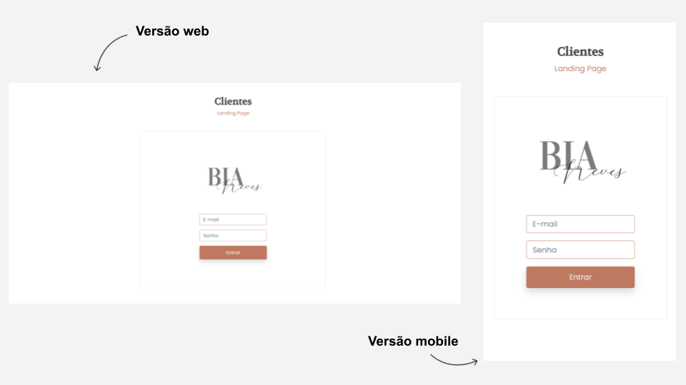
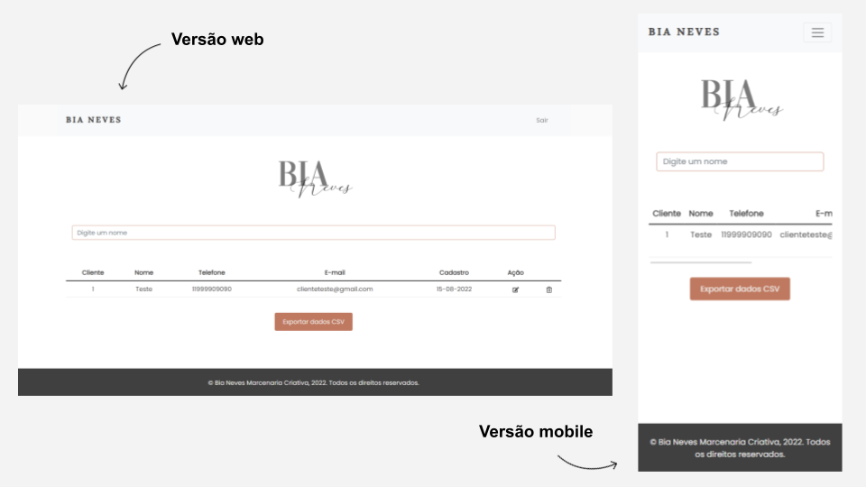

# bianeves-web-app

## Sobre o projeto

Visite a Landing Page em: [https://bianeves.com/

Este site faz parte do projeto de curricularização da extensão proposto nas disciplinas de  Projeto Back-end Monolítico ORM, ministrada pelo Professor Mestre [Edson Angoti Júnior](http://lattes.cnpq.br/1681708090757083), e Projeto Front-end JavaScript, ministrada pelo Professor Doutor [Wilton de Paula Filho](http://lattes.cnpq.br/8519943668038093), do curso de `Sistemas para Internet` do `Instituto Federal de Educação, Ciência e Tecnologia do Triângulo Mineiro - IFTM`.

O projeto consiste no desenvolvimento de uma `Landing Page` para um cliente selecionado por meio de [edital](https://iftm.edu.br/uberlandiacentro/apoio-projetos-extensao/edital.php?id=Vcny__gNwITMSCRJ7212HqN) aberto à comunidade.

Além da landing page, o projeto conta com uma página web com acesso feito por meio de autenticação, que permite que o administrador gerencie os clientes captados provenientes da landing page, podendo realizar operações de CRUD (create, read, update e delete).

O desenvolvimento (programação) e visual (design das telas) é de nossa autoria e está disponível para a comunidade utilizar.

Todas as imagens e vídeo são de propriedade de Bianca Neves e não devem ser utilizados. Quanto aos ícones, os mesmos foram retirados do repositório gratuitos [flaticon](https://www.flaticon.com/br/).

### Instalação e inicialização do projeto

Para iniciar o Back-End, abra-o com a IDE de sua preferência com as tecnologias utilizadas logo abaixo. Inicie o back-end pela IDE ou atraves do comando: mvnw spring-boot:run. Com o Back-End em execução abra a pasta do Front-End com vs-code e execute o comando npn install, esse comando vai baixar tudo que o projeto precisa para ser executado (para visualizar, olhe o arquivo [package.json](https://github.com/arthurjs92/web-app-bianeves/blob/main/frontend/package.json)). Quando terminar o download execute o comando npn start, para iniciar o Front-End. Com o Back-End e o Front-End em execução, acesse as URI abaixo para ter acesso ao localhost.

Back-End: http://localhost:8080/

Front-End: http://localhost:3000/

## Tecnologias utilizadas:

- Front-End:
    * HTML5 para a publicação
    * CSS3 para estilização
    * Bootstrap para responsividade
    * JavaScript com react-hook-form
    * React para criar a interface
    * Node para compilar e executar
    * Axios para criar requisições HTTP
    * Validação do formulário com Yup
    * Icones utilizados da biblioteca react-icons
    * js-file-download para salvar os dados em um arquivo como download

- Back-End:
    * Java com Spring Boot
    * Spring Validation
    * Spring Data JPA
    * Spring Security com token JWT
    * Lombok para produtividade e redução de código
    * Gerenciamento de projeto com Maven
    * Banco de dados MySQL
    * Documentação com Swagger
    * Postman para documentação e teste

- Hospedagem:
    * AWS
        * Elastic Beanstalk
        * RDS
        * Route 53
        * Certificate Manager

## Layout - Landing Page

### Web:

### Mobile:

## Layout - Thank You Page

Após o preenchimento do formulário contido na Landing Page o usuário é direcionado à uma página de agradecimento, que também conta com links para as redes sociais.

### Web e Mobile - Thank you page:

## Layout - Admin Page

Na página de admin além de realizar operações de `CRUD`, é possível exportar os dados dos clientes cadastrados em formato CSV para `Excel`.
### Web e Mobile - Login:

### Web e Mobile - Home:

## Autores

Arthur José dos Santos

Patrícia Magalhães Sotero Rocha

